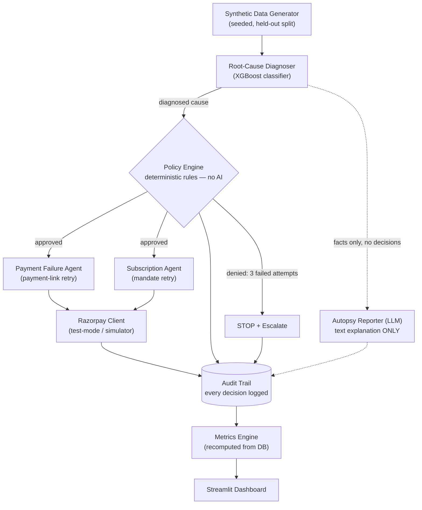

# Ghost Ledger v2

**Track:** Razorpay AI Buildathon — 03: AI Revenue Recovery

**This is the agent Track 3 asks for.** Razorpay's brief: *"Build an agent
that detects revenue at risk, determines the right intervention, and
executes a bounded recovery workflow."* Ghost Ledger is that agent, end to
end — one perceive → decide → act → log loop per failed transaction, with
two intervention capabilities (payment-link retry, subscription mandate
retry) it chooses between, not two separate agents bolted together.

> *Detect revenue at risk → diagnose root cause → execute a bounded recovery
> action → report the recovered ₹, honestly.*

| Razorpay's bar | Where it's satisfied |
|---|---|
| "detects revenue at risk" | `diagnoser/root_cause_classifier.py` |
| "determines the right intervention" | `agents/recovery_base.py` dispatch — picks the capability by failure type |
| "executes a **bounded** recovery workflow" | `agents/policy_engine.py` gates every action (amount cap, attempt cap) |
| "compliant escalation, stopping rules" | 3-failed-attempts → halt, escalate, cannot be overridden |
| "an audit trail" | `database/audit_trail.py`, every decision logged before execution |

---

## Architecture



Solid arrows are the money path (all deterministic, all policy-gated). The
dashed arrow is the only place an LLM appears in the whole system — it reads
the diagnosis to write a plain-English sentence and cannot influence any
decision above it.

---

## One command (clean checkout)

```bash
pip install -r requirements.txt
python main.py                 # full pipeline: generate → diagnose → act → log
streamlit run dashboard/app.py # dashboard on http://localhost:8501
```

`python main.py` on a clean checkout generates the dataset, trains the
diagnoser (it is not shipped), runs recovery, and writes reports. First run
takes ~1.5 min because of model tuning; later runs take ~20 s.

---

## What the agent does

One agent, one decision loop per failed transaction, two intervention
capabilities it chooses between based on failure type:

| # | Stage | Component |
|---|---|---|
| 1 | Perceive — synthetic 30-day merchant history, seeded, with held-out split | `data/synthetic_generator.py` |
| 2 | Diagnose — root-cause classification into 4 cause buckets + confidence | `diagnoser/root_cause_classifier.py` |
| 3 | Decide (bounded) — deterministic policy gate (₹10k ceiling, 3-attempt cap, stop rule) | `agents/policy_engine.py` |
| 4a | Act — capability: payment-link retry | `agents/payment_failure_agent.py` |
| 4b | Act — capability: subscription mandate retry | `agents/subscription_agent.py` |
| 4a | Payment Failure Agent → Razorpay Payment Link + retry | `agents/payment_failure_agent.py` |
| 4b | Subscription Agent → mandate retry sequence | `agents/subscription_agent.py` |
| 5 | Plain-English autopsy (LLM, text only) | `agents/autopsy_reporter.py` |
| 6 | Full audit trail of every decision | `database/audit_trail.py` |
| 7 | Dashboard: headline, trend, stops, precision/recall, audit table | `dashboard/app.py` |

---

## Design commitments

**No LLM in the money path.** The LLM writes the 2–3 sentence autopsy and
nothing else. Every decision that moves money, retries a payment, or stops an
action is deterministic Python in `agents/policy_engine.py`. If the LLM is
unreachable the system falls back to a template and keeps running.

**The agent knows when to stop.** After 3 failed attempts the policy engine
halts, escalates, and logs the reason. It does not retry, does not "try once
more", and cannot be overridden — not even by a human approval flag. This is
covered by six tests and is visible live in the dashboard.

**Every action is logged before execution, pass or fail.** Denied actions are
in the audit trail too; the trail is not a success log.

**No bare metrics.** Every precision/recall figure carries `n` and the split
method that produced it (NFR-004). The dashboard renders both.

---

## Results

Held-out batch, **n = 1,815** failed transactions:

| | |
|---|---|
| ₹ Recovered | **₹1,907,719.68** |
| ₹ At Risk | ₹2,646,060.94 |
| Recovery rate | **72.10%** |
| Stopping-rule stops | 440 |
| Recovery actions | 3,816 |
| Audit records | 7,633 |

Diagnoser (XGBoost, 40 configs × 5-fold grouped CV): **macro-F1 0.9709**,
accuracy 0.9758, CV 0.9726 ± 0.0019.

### Read the attribution before quoting 0.9709

The error code Razorpay returns is highly informative. Decomposed:

| Condition | Accuracy | Macro-F1 |
|---|---|---|
| `error_code` → majority cause **lookup, no ML** | 0.9289 | 0.9291 |
| Full model (40 features) | 0.9758 | **0.9709** |
| Model with `error_code` removed (28 features) | 0.8738 | 0.8264 |

The honest framing is **+0.042 macro-F1 over a lookup table**, and **0.8264
from transaction context alone** when the error code is withheld. The
generator's error-code distributions were deliberately *not* weakened to make
this number look more modest — depressing a metric on purpose is the same
dishonesty as inflating one.

**Split method:** random, grouped by customer — 400 of 2,000 customers drawn
at random (seed 42); all of a held-out customer's transactions are held out, so
**0 customers appear in both splits**. Chooses `random_grouped` / `random_rows`
/ `temporal` via `SPLIT_STRATEGY`.

---

## Settlement is simulated

No Razorpay test credentials are configured in this environment, so recovery
outcomes come from `api/razorpay_client.py`'s offline simulator: Razorpay-shaped
responses, cause-dependent success rates, seeded, with injected timeouts and
429s. The dashboard shows a persistent banner saying so.

To use real test-mode endpoints, put keys in `.env`:

```
RAZORPAY_KEY_ID=rzp_test_xxxxxxxxxxxx
RAZORPAY_KEY_SECRET=xxxxxxxxxxxxxxxx
RAZORPAY_LIVE_TEST_MODE=1
```

No calling code changes. On any auth/network/timeout error the client degrades
to the simulator and marks the response `degraded=True` (NFR-002).

---

## Configuration

All in `.env` (see `.env.example`); every value has a safe offline default.

| Variable | Default | Meaning |
|---|---|---|
| `DATASET_PROFILE` | `train` | `demo` (5k txns) / `train` (102k) / `max` (251k) |
| `DATA_SEED` | `42` | Master RNG seed — output is byte-reproducible |
| `SPLIT_STRATEGY` | `random_grouped` | `random_grouped` / `random_rows` / `temporal` |
| `LLM_BACKEND` | `ollama` | `ollama` / `openai` / `template` |
| `LLM_MODEL` | `llama3.2:3b` | Model name for the chosen backend |
| `RAZORPAY_LIVE_TEST_MODE` | `0` | `1` = real test-mode API |
| `POLICY_MAX_AUTO_APPROVE_INR` | `10000` | R1 ceiling |
| `POLICY_MAX_ATTEMPTS_PER_FAILURE` | `3` | R2/R3 cap |

---

## Testing

```bash
python -m pytest tests/ -q     # 49 tests, ~3s
```

Tests run against a copy of the database (`data/test_ghost_ledger.db`) so
fixtures never pollute the demo figures. Covers the 3-attempt stopping rule,
denial precedence, diagnoser output shape and provenance, explainability,
end-to-end recovery, empty batch, and API-timeout degradation.

---

## Repository layout

```
ghost-ledger/
├── main.py                     one-command pipeline
├── metrics.py                  single source of truth for every figure
├── weekly_report.py            FR-009 weekly recovery report
├── config.py                   all tunables, no secrets
├── data/synthetic_generator.py FR-001 seeded generator + held-out split
├── diagnoser/
│   ├── root_cause_classifier.py  FR-002 XGBoost + grouped CV + tree-SHAP
│   ├── eval_holdout.py           held-out precision/recall, with n + basis
│   ├── train.py                  tuning + evaluation entry point
│   └── split_experiment.py       leakage sensitivity experiment
├── agents/
│   ├── policy_engine.py        FR-003 deterministic guardrails
│   ├── recovery_base.py        shared policy-gated retry sequence
│   ├── payment_failure_agent.py  FR-004a
│   ├── subscription_agent.py     FR-004b
│   └── autopsy_reporter.py     FR-005 LLM text, never in the money path
├── api/razorpay_client.py      FR-008 live test-mode + simulated backends
├── database/                   schema, client, audit trail
├── dashboard/                  FR-007 Streamlit UI + components
├── tests/                      49 tests
├── reports/                    generated metrics, weekly report, checkpoints
└── FAILURES.md                 dated log of every real blocker
```

Additive beyond the spec's folder list: `metrics.py`, `agents/recovery_base.py`,
`diagnoser/train.py`, `diagnoser/split_experiment.py`, `weekly_report.py`,
`config.py`, and one table `autopsy_reports`. Nothing in the spec's four tables
was modified, renamed, or removed.

---

## Honest limitations

- **Settlement is simulated**, not live Razorpay (see above).
- **Recovery rates are model assumptions**, not empirical measurements. The
  33% subscription mandate failure rate is a stated modelling assumption,
  recorded in `generation_manifest.json`, not observed data.
- **`autopsy_reports` is one table beyond spec §11** — additive only, because
  none of the four spec tables has a text column for the autopsy output.
- **Autopsy is sampled with a live model** (~1 s per report); with the
  `template` backend all 1,815 are generated.
- **Tuning takes ~3 min.** `python diagnoser/train.py` does the full 40-config
  search; `main.py` uses a reduced 15-config search on first run only.

---
## Author

**R K Jegan**

B.Tech Artificial Intelligence & Data Science
---